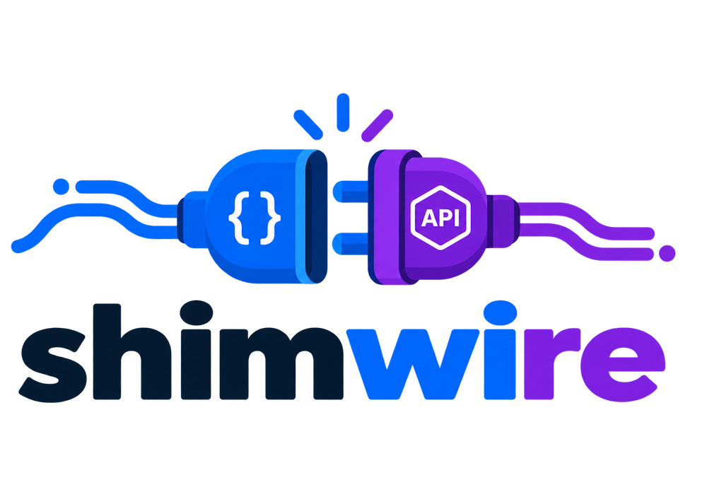
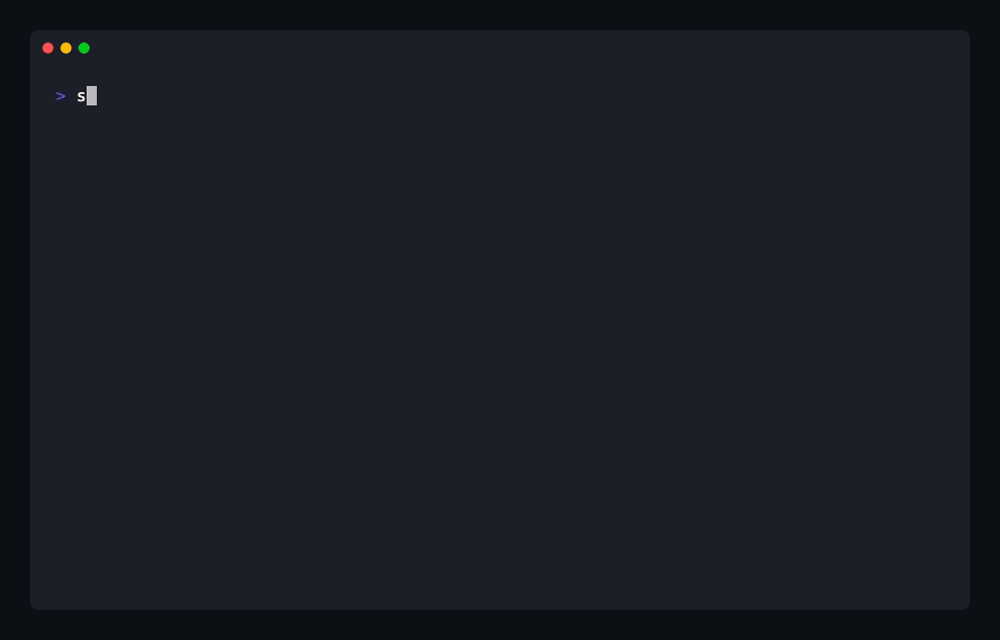
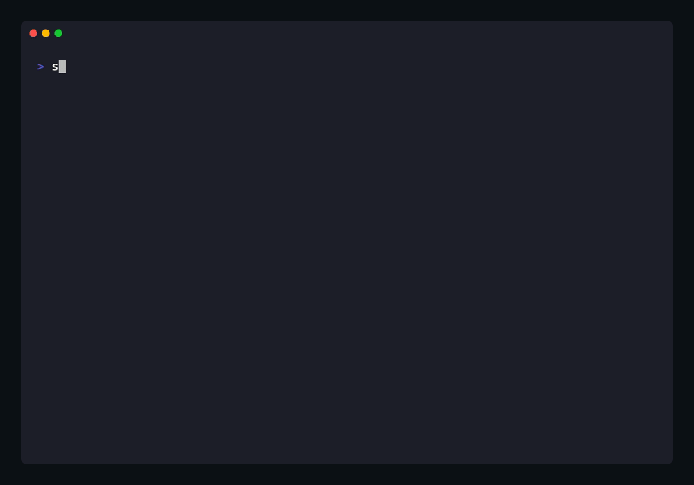
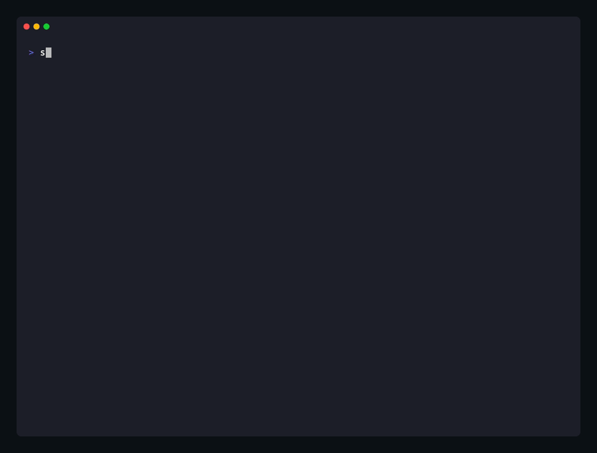
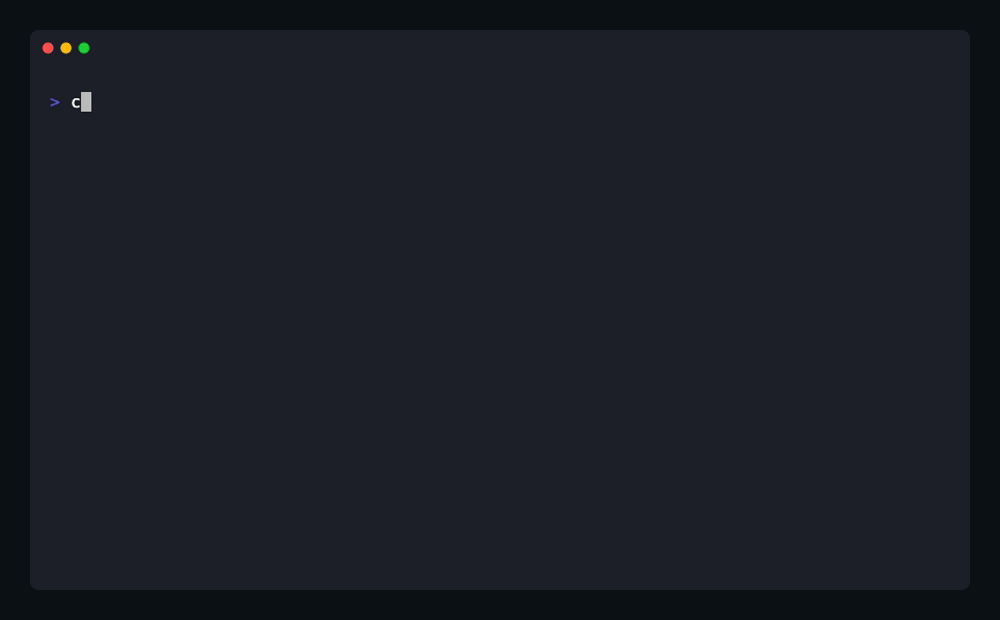

<div align="center">

<picture>
  <source media="(prefers-color-scheme: dark)" srcset="assets/logo-dark.png">
  <source media="(prefers-color-scheme: light)" srcset="assets/logo-light.png">
  
</picture>

**One tool for both sides of an API you don't fully control yet: mock the parts that aren't built, and test the parts that are.**

[](https://github.com/caspel26/shimwire/actions/workflows/ci.yml)
[](LICENSE)
[](https://bun.sh)
[](https://www.typescriptlang.org/)
[](#contributing)



</div>

`shimwire` reads an OpenAPI 3.x or Swagger 2.0 spec (older specs are converted automatically) and gives you two things from it, powered by one shared engine so they never drift apart:

- 🧪 **Mock mode** — a fake-but-schema-valid API server, so frontend work isn't blocked waiting on a backend.
- 🚀 **Client mode** — a scriptable, git-friendly HTTP test runner. Collections are version-controlled TOML files you can diff and review in a PR, not JSON blobs locked in a proprietary cloud tool.

---

## Table of contents

- [✨ Features](#-features)
- [🤔 Why](#-why)
- [📦 Installation](#-installation)
- [🚀 Quick start](#-quick-start)
- [🧰 Commands](#-commands)
- [⚙️ Configuration](#️-configuration)
- [🖥️ Testing a frontend against the mock server](#️-testing-a-frontend-against-the-mock-server)
- [📄 Collection format](#-collection-format)
- [🩹 Errors & debugging](#-errors--debugging)
- [🏗️ Stack](#️-stack)
- [🤝 Contributing](#-contributing)
- [📜 License](#-license)

## ✨ Features

- 🔀 **Spec-driven** — mock server and test collections both come from the same OpenAPI/Swagger spec, so they can never disagree with each other.
- 📁 **Git-native collections** — plain TOML, reviewable in a normal PR diff, no proprietary cloud format.
- 🌐 **CORS-ready mock server** — on by default, so a browser frontend on another port just works.
- 📡 **Live request log** — watch your frontend's traffic hit the mock in real time.
- 🎭 **Realistic fake data** — schema-aware (respects `type`, `format`, `enum`, `min`/`max`), not just random junk.
- 🎯 **Overrides** — force a specific status, inject latency, or pin an exact response for edge-case testing.
- 🤖 **Auto-scaffolding** — `generate` builds a runnable collection from your spec, guessing request chaining and pre-filling auth.
- 🖱️ **Interactive CLI** — a guided menu (`shimwire cli`) for exploring a spec without memorizing flags.
- 📊 **HTML reports** — readable request/response detail for `run`, not just terminal noise.
- 🩺 **Clean errors** — one readable line and exit code 1 on failure, not a raw stack trace.

## 🤔 Why

Postman/Insomnia-style tools lock collections into proprietary formats that don't diff cleanly in git and don't run well in CI. Meanwhile, mocking a backend usually means hand-rolling fixtures that quietly drift from the real API contract. If you already have an OpenAPI (or Swagger 2.0) spec, both problems have the same fix: derive the mock _and_ the test collection from that one source of truth — see [Features](#-features) above for what that gets you in practice.

## 📦 Installation

Requires [Bun](https://bun.sh) — shimwire runs directly off its `#!/usr/bin/env bun` shebang, no separate build/Node install needed.

```bash
npm install -g shimwire
# or, without installing anything:
bunx shimwire <command>
```

Prefer building from source (or want to contribute)?

```bash
git clone https://github.com/caspel26/shimwire
cd shimwire
bun install
bun run src/cli.ts <command>
```

Standalone binaries (no Bun install required to run) may come later.

## 🚀 Quick start

```bash
# scaffold a project
cd my-project/
shimwire init
# creates .shimwire/{collections,env,mock}/

# backend not ready yet? mock it from the OpenAPI/Swagger spec
shimwire mock openapi.yaml --port 4000
# GET  /users   → 200
# POST /users   → 201

# backend exists? auto-scaffold a runnable test collection from the same spec
shimwire generate --from openapi.yaml --out users.toml

# run it against a real backend
shimwire run users.toml --env dev
# ✓ create_user   POST /users        201  142ms
# ✓ get_user      GET  /users/42     200  38ms

# wire into CI
shimwire run smoke.toml --env staging --fail-on-error

# get a readable HTML report instead of squinting at terminal lines
shimwire run users.toml --env dev --report report.html
```

Prefer answering a few prompts instead of remembering flags? Try `shimwire cli` for a guided interactive menu.

<details>
<summary><strong>Full transcript</strong> (text version of the recording above)</summary>

```console
$ shimwire init
Created .shimwire/ in my-project
  .shimwire/collections/
  .shimwire/env/
  .shimwire/mock/
  .shimwire/config.toml (commented-out defaults for generate/run/mock)
  .gitignore (created — keeps .shimwire/env/*.toml out of git)

$ shimwire mock ./openapi.yaml --port 4100 --no-watch &
Loading spec from ./openapi.yaml...
Mock server running on http://localhost:4100
  GET    /pets  → 200
  POST   /pets  → 201
  GET    /pets/{id}  → 200

$ shimwire generate --from ./openapi.yaml --out .shimwire/collections/pets.toml
Loading OpenAPI spec from ./openapi.yaml...
Loaded "Petstore" — 2 path(s)
Generating collection...
Writing .shimwire/collections/pets.toml...
Wrote 3 request(s) to .shimwire/collections/pets.toml
1 item(s) flagged for manual review — see file header.

$ shimwire run .shimwire/collections/pets.toml --env dev
✓ list_pets       GET    /pets  200  7ms
✓ create_pet      POST   /pets  201  1ms
✓ get_pet         GET    /pets/44bf8c98-8527-4f60-b5d0-3b68dca9685a  200  0ms

$ shimwire run .shimwire/collections/pets.toml --env staging --fail-on-error
✗ list_pets       Unable to connect. Is the computer able to access the url?
✗ create_pet      Unable to connect. Is the computer able to access the url?
✗ get_pet         Unknown or not-yet-run step "steps.create_pet"

$ echo $?
1
```

That last block is the whole point: the same collection that runs clean against `dev` catches a broken `staging` environment, and the nonzero exit code is exactly what `--fail-on-error` is for in a CI job.

</details>

## 🧰 Commands

### `shimwire init`

Scaffolds `.shimwire/{collections,env,mock}/`, a starter `.shimwire/config.toml`, and a `.gitignore` entry protecting `.shimwire/env/*.toml` secrets.

### `shimwire cli`

Launches an interactive menu — pick "Mock", "Generate", "Workflow", "Run", or "Init" and answer a few validated prompts instead of remembering flags. Pre-fills answers from `.shimwire/config.toml` when present. Picking "Mock" starts the server in the background and returns to the menu, so you can immediately pick "Run" to test against it; after "Generate" it offers to run the collection it just wrote; "Workflow" lists every endpoint in a spec as a checkbox list to build a `.shimwire/workflows/<name>.toml` without knowing ids up front. Useful when you're exploring a new spec rather than scripting something repeatable.

<p align="center">
  
</p>

### `shimwire mock [spec]`

Serves fake-but-schema-valid responses for every endpoint in a spec.

| Flag                     | Default                                    | Description                                                                                       |
| ------------------------ | ------------------------------------------ | ------------------------------------------------------------------------------------------------- |
| `[spec]`                 | —                                          | Path or URL to an OpenAPI 3.x / Swagger 2.0 spec. Falls back to `[mock].spec` in config.          |
| `-p, --port <port>`      | `4000`                                     | Port to listen on.                                                                                |
| `--overrides <path>`     | `.shimwire/mock/overrides.toml` if present | Force specific status codes, bodies, or latency.                                                  |
| `-l, --allow-local`      | off                                        | Allow fetching `spec` from localhost/private-network URLs (disables swagger-parser's SSRF guard). |
| `-k, --insecure`         | off                                        | Skip TLS certificate verification while fetching `spec` (self-signed local certs).                |
| `--cors` / `--no-cors`   | CORS on                                    | Toggle permissive CORS headers.                                                                   |
| `--watch` / `--no-watch` | watch on                                   | Toggle a live log line (time, method, path, status, duration) for every incoming request.         |

### `shimwire generate`

Auto-scaffolds a runnable collection from a spec, guessing request chaining and pre-filling auth.

| Flag                          | Default                        | Description                                                                                  |
| ----------------------------- | ------------------------------ | -------------------------------------------------------------------------------------------- |
| `-f, --from <spec>`           | —                              | Path or URL to an OpenAPI 3.x / Swagger 2.0 spec. Falls back to `[generate].from` in config. |
| `-o, --out <path>`            | —                              | Output path for the generated collection `.toml`. Falls back to `[generate].out`.            |
| `-s, --security <schemeName>` | first auto-configurable scheme | When a spec offers multiple auth alternatives, pin one by name.                              |
| `-l, --allow-local`           | off                            | Same SSRF-guard override as `mock`.                                                          |
| `-k, --insecure`              | off                            | Same TLS bypass as `mock`.                                                                   |

If the spec has a login-shaped operation (by operationId/path, e.g. `POST /auth/login`) whose response has a token-shaped field, `generate` extracts it into `.shimwire/workflows/authentication_flow.toml` (see [Reusable workflows](#reusable-workflows)) instead of generating it as a top-level request, and every bearer-secured request gets `depends_on = ["login"]` with its token pointed at the login step's actual response field — instead of the static `{{env.token}}` guess. Always flagged for review: the login step's body has faked credentials, since real ones can't be guessed.

### `shimwire workflow`

Hand-pick specific endpoints from a spec and save them as a reusable `.shimwire/workflows/<name>.toml` — for building a workflow yourself rather than relying on `generate`'s login auto-detection above, e.g. a multi-step flow that isn't just a single login call.

| Flag                          | Default                        | Description                                                                                  |
| ----------------------------- | ------------------------------ | -------------------------------------------------------------------------------------------- |
| `-f, --from <spec>`           | —                              | Path or URL to an OpenAPI 3.x / Swagger 2.0 spec. Falls back to `[generate].from` in config. |
| `-n, --name <workflowName>`   | —                              | Workflow file to write, under `.shimwire/workflows/`.                                        |
| `-e, --endpoints <ids>`       | —                              | Comma-separated request ids to include.                                                      |
| `-s, --security <schemeName>` | first auto-configurable scheme | Same as `generate`.                                                                          |
| `-l, --allow-local`           | off                            | Same SSRF-guard override as `mock`.                                                          |
| `-k, --insecure`              | off                            | Same TLS bypass as `mock`.                                                                   |

```bash
shimwire workflow --from openapi.yaml --name authentication_flow --endpoints login
```

Don't know the ids offhand? `shimwire cli` → "Workflow" lists every operation in the spec as a checkbox list (method, path, and the id it'll get) instead of requiring `--endpoints` up front.

### `shimwire run <collection>`

Runs a collection — or a standalone workflow — against a real backend.

| Flag                  | Default | Description                                                                                                              |
| --------------------- | ------- | ------------------------------------------------------------------------------------------------------------------------ |
| `-e, --env <name>`    | `dev`   | Environment file under `.shimwire/env/<name>.toml`.                                                                      |
| `--only <id>`         | —       | Run a single request plus its dependencies.                                                                              |
| `--fail-on-error`     | off     | Exit non-zero if any request fails — for CI.                                                                             |
| `-k, --insecure`      | off     | Skip TLS certificate verification.                                                                                       |
| `-r, --report <path>` | —       | Write an HTML report (full request/response detail, sensitive headers redacted). Falls back to `[run].report` in config. |

A workflow (`.shimwire/workflows/<name>.toml`) can be run directly, the same as any collection — no need to wrap it in one just to try it out:

```bash
shimwire run .shimwire/workflows/authentication_flow.toml --env dev
# or, resolved the same way collection names are:
shimwire run authentication_flow.toml --env dev
```

`run` detects which shape a file is (a collection has `[meta]`, a workflow doesn't) and, for a bare workflow, resolves `{{env.base_url}}` from `--env` exactly like a hand-written collection would.

### `shimwire mcp`

Starts an [MCP](https://modelcontextprotocol.io) server (stdio transport) exposing shimwire's spec/collection/workflow tools to an AI client — Claude Desktop, Claude Code, or anything else that speaks MCP. Point a client's config at it:

```json
{ "mcpServers": { "shimwire": { "command": "bunx", "args": ["shimwire", "mcp"] } } }
```

The recording below isn't a shimwire subcommand — it's [`assets/mcp-demo-client.ts`](assets/mcp-demo-client.ts), a small standalone script standing in for an AI agent, so you can see real tool calls and real responses instead of trusting a description:

<p align="center">
  
</p>

| Tool                                  | Does                                                                                                                                                                    |
| ------------------------------------- | ----------------------------------------------------------------------------------------------------------------------------------------------------------------------- |
| `load_spec`                           | Parse a spec, list every operation's id/method/path — see what's actually available before generating anything.                                                         |
| `init_project`                        | Scaffold `.shimwire/`.                                                                                                                                                  |
| `generate_collection`                 | Same as `shimwire generate` — full collection from a spec, login auto-detected into a workflow.                                                                         |
| `create_workflow`                     | Same as `shimwire workflow` — hand-picked endpoints saved as a named workflow.                                                                                          |
| `list_collections` / `list_workflows` | See what's already in the project.                                                                                                                                      |
| `run_collection`                      | Run a collection or workflow, get structured pass/fail back per step — so the result can be checked, not just assumed.                                                  |
| `start_mock`                          | Start a mock server from a spec — same engine as `shimwire mock` — and leave it running in the background. Returns an id.                                               |
| `list_mocks`                          | See every mock server started this session that hasn't been stopped.                                                                                                    |
| `get_mock_requests`                   | Pull a mock's recent traffic (method/path/status/duration) — the request/response equivalent of `--watch`'s live log, since that can't be streamed over this transport. |
| `stop_mock`                           | Stop a mock server started with `start_mock`, by id.                                                                                                                    |

Every tool accepts an optional `cwd`, since an MCP server is typically one long-running process reused across projects/sessions rather than started fresh per-project the way a CLI invocation is. Tool calls are executed one at a time on the server regardless of client pipelining — JSON-RPC over stdio allows a client to fire several calls without waiting for a response first, and two calls touching different directories at once would otherwise race on the server process's working directory. A client that needs one call's result before issuing the next (e.g. `generate_collection`'s file existing before `run_collection` reads it) still has to await it first, same as any RPC API — the server can't infer that dependency on its own.

Every mock started with `start_mock` is tied to the MCP server process's own lifetime — they're all closed automatically if the process exits (`SIGINT`/`SIGTERM`), so a client disconnecting doesn't leave orphaned servers behind. `start_mock` doesn't take a `watch` option the way `shimwire mock --watch` does — stdout on this transport _is_ the JSON-RPC channel, so request activity can't be printed live; `get_mock_requests` is the pull-based alternative instead.

## ⚙️ Configuration

`generate`, `run`, and `mock` all read defaults from a per-project `.shimwire/config.toml` — useful for a spec/backend you test against repeatedly. Any CLI flag you do pass overrides the corresponding config value; nothing else changes.

```toml
# .shimwire/config.toml
[generate]
from = "https://localhost:8080/api/v2/openapi.json"
out = ".shimwire/collections/api.toml"
security = "APIKeyAuth"
allow_local = true   # allow fetching `from` from localhost/private-network URLs
insecure = true       # skip TLS verification (self-signed local certs)

[run]
report = ".shimwire/reports/latest.html"   # always write a report, without passing --report

[mock]
spec = "https://localhost:8080/api/v2/openapi.json"
port = 4000
allow_local = true
insecure = true
cors = true
```

With that in place, `shimwire generate`, `shimwire run <collection>`, and `shimwire mock` all work with zero flags. `--allow-local` and `--insecure` disable safety checks (an SSRF guard and TLS certificate verification, respectively) meant for untrusted specs — only enable them for your own local/dev servers.

## 🖥️ Testing a frontend against the mock server

Point your frontend's API base URL at the mock server instead of a real backend:

```bash
shimwire mock openapi.yaml --port 4000
```

- **CORS is on by default** — a browser frontend running on a different origin/port (e.g. `localhost:5173` calling `localhost:4000`) works out of the box, including preflight `OPTIONS` requests. Pass `--no-cors` if you specifically want to test your frontend's own CORS failure handling.
- **Watch traffic live** — every incoming request prints a colored line (time, method, path, status, duration) so you can see exactly what your frontend is calling. Pass `--no-watch` to quiet it down.
- **Simulate edge cases** with `.shimwire/mock/overrides.toml` — force a specific status, inject artificial latency (loading states), or pin an exact response body, independently of each other:

  ```toml
  [[override]]
  path = "/users/{id}"
  method = "GET"
  status = 404              # force a not-found state
  when = "id == '999'"      # only for this specific id

  [[override]]
  path = "/users"
  method = "GET"
  latency_ms = 2000          # simulate a slow network without changing the response

  [[override]]
  path = "/users/{id}"
  method = "GET"
  body = { id = "1", name = "Ada Lovelace", status = "active" }  # pin an exact response
  ```

- Every other endpoint not covered by an override still returns schema-valid random data on every call, so your frontend gets realistic variety (different names, IDs, enum values) without you writing fixtures for all of it.
- **Sequence a response across calls** — with `sequence`, each request advances to the next step; once it runs out, the last step repeats (`sequence_mode = "cycle"` wraps back to the first instead). Handy for testing retry logic — e.g. the first two calls fail, then it recovers:

  ```toml
  [[override]]
  path = "/orders/{id}"
  method = "POST"
  sequence = [
    { status = 500 },
    { status = 500 },
    { status = 200 },
  ]
  ```

  A `sequence` entry can't also set a top-level `status`/`body` — put those in the steps instead.

- **Match a family of paths** instead of one exact route — `*` in `path` stands in for exactly one segment (the same way `{id}` already does), `**` matches any number of segments, and `path_regex` is a full-regex escape hatch for anything a glob can't express:

  ```toml
  [[override]]
  path = "/admin/**"
  method = "GET"
  status = 403              # lock down every admin sub-route at once
  ```

  An override needs exactly one of `path` or `path_regex`.

- **`when` isn't limited to path params** — prefix the key with `query.` or `header.` to match a query string value or a request header (matched case-insensitively, like HTTP itself):

  ```toml
  [[override]]
  path = "/users"
  method = "GET"
  status = 400
  when = "query.broken == 'true'"   # only when ?broken=true is present
  ```

## 📄 Collection format

```toml
[meta]
name = "Users API"
base_url = "{{env.base_url}}"

[[request]]
id = "create_user"
method = "POST"
path = "/users"
[request.body]
name = "{{faker.name}}"
email = "{{faker.email}}"

[[request]]
id = "get_user"
method = "GET"
path = "/users/{{steps.create_user.response.id}}"
depends_on = ["create_user"]
```

Variables resolve from three sources: `env.*` (from `.shimwire/env/<name>.toml`), `faker.*` (any `@faker-js/faker` method path), and `steps.<id>.*` (a prior request's status/response in the same run).

### Reusable workflows

If several collections need the same setup steps — logging in before every request, say — pull them out into `.shimwire/workflows/<name>.toml` once and `include` it wherever it's needed, instead of copy-pasting the same requests into every collection:

```toml
# .shimwire/workflows/authentication_flow.toml
[[request]]
id = "login"
method = "POST"
path = "/auth/login"
[request.body]
username = "{{env.username}}"
password = "{{env.password}}"
```

```toml
# .shimwire/collections/users.toml
[meta]
name = "Users API"
base_url = "{{env.base_url}}"
include = ["authentication_flow"]

[[request]]
id = "get_user"
method = "GET"
path = "/users/42"
depends_on = ["login"]
[request.headers]
Authorization = "Bearer {{steps.login.response.token}}"
```

A workflow is just a request list — no `[meta]`/`base_url` of its own, it inherits the including collection's. Included requests run before the collection's own by default, and their ids/steps work exactly like any other request (`depends_on`, `steps.login.response.*`, etc.) — `run` doesn't know or care that `login` came from a different file.

A workflow doesn't have to be included to be useful — `shimwire run` can execute one directly (see [`shimwire run`](#shimwire-run-collection)), so a self-contained task like "authenticate and create a user" can be built as its own workflow and run standalone, without ever wrapping it in a collection.

<p align="center">
  
</p>

## 🩹 Errors & debugging

Every command fails with a single readable line (bad spec, missing config, port already in use, etc.) and exit code 1, instead of a raw stack trace. Set `SHIMWIRE_DEBUG=1` to see the full stack when you need it:

```bash
SHIMWIRE_DEBUG=1 shimwire mock ./bad-spec.yaml
```

## 🏗️ Stack

TypeScript on [Bun](https://bun.sh) · `commander` · `fastify` · `@fastify/cors` · `@apidevtools/swagger-parser` · `swagger2openapi` · `@faker-js/faker` · `smol-toml` · `zod` · `picocolors`

**Why Bun instead of Node/npm?** They're not the same category of tool — npm is a package manager for code that runs under Node, while Bun is a package manager _and_ a JS/TS runtime that replaces Node entirely. Specifically:

- Native TypeScript execution — `bun run src/cli.ts` just works, no build step or `ts-node`/`tsx` in the dev loop.
- Fast startup, which matters for a CLI invoked constantly, unlike a long-running server where startup cost is amortized.
- Built-in test runner (`bun test`, Jest-compatible), no separate test dependency.
- `bun build --compile` produces a single native binary per platform — the whole Phase 5 distribution story (download a binary, no Bun/Node install required to run it) depends on this.

The tradeoff: Bun's Node-compatibility is very good but not perfect. For this project's dependency list — all popular, well-maintained packages — that risk is low.

## 🤝 Contributing

Contributions of any size are welcome — a typo fix, a bug report, a new override capability, or a completely different perspective on the design. This is a solo side project in its early days, so there's no formal process to navigate:

1. **Found a bug or have an idea?** [Open an issue](https://github.com/caspel26/shimwire/issues) — even a rough one is useful.
2. **Want to send a PR?** Fork, branch, and:
   ```bash
   bun install
   bun test
   bun run lint
   ```
   Make sure both pass before opening the PR. Small, focused PRs are easiest to review and merge.
3. **Not sure where to start?** The codebase is small enough to read in one sitting: `src/core/` for the shared engine (parser, faker, variable resolver), `src/commands/` for the CLI surface, `src/mockServer/` for the fastify-based mock. Read [shimwire-implementation-plan.md](shimwire-implementation-plan.md) for the design rationale before proposing anything structural — it explains _why_ things are built the way they are, which saves a round-trip on bigger changes.

If you use shimwire and it helps you, a ⭐ on the repo is genuinely appreciated — it's a good signal that iterating on this is worth the time.

## 📜 License

MIT — see [LICENSE](LICENSE).
